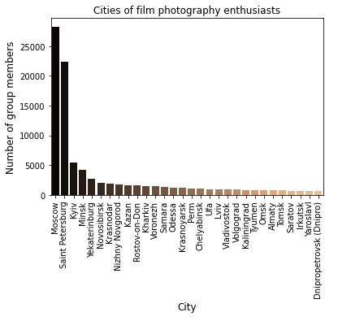
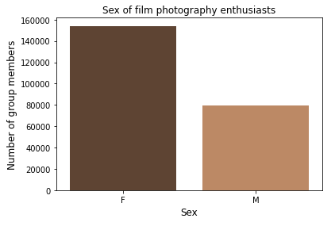
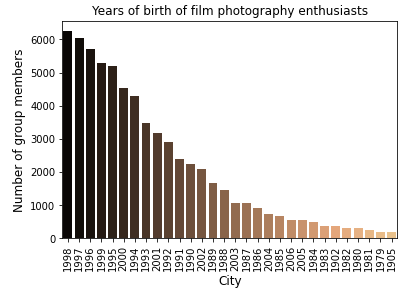
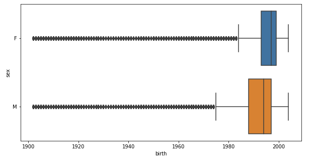

# Project_film_photography
## Территория развития пленочной фотографии
_Выполнили: Мельникова Татьяна, Боброва Анна, Митина Алёна, Левина Юлиана_

Наш проект посвящен изучению развития пленочной фотографии на основе анализа групп ВКонтакте, посвященных этой теме.
Для исследования мы выбрали следующие группы: [無秩序と工芸](https://vk.com/besporyadokitehnologia), [Плёнка](https://vk.com/trita.plenka), [Зелёная зона](https://vk.com/zonazeleni) и [ПленКа](https://vk.com/plenka_predlozhka). 

Мы поставили перед собой следующие задачи:
1. Выявить центры наибольшей популярности пленочной фотографии на основе участников 4-х групп: [無秩序と工芸](https://vk.com/besporyadokitehnologia), [Плёнка](https://vk.com/trita.plenka), [Зелёная зона](https://vk.com/zonazeleni), [ПленКа](https://vk.com/plenka_predlozhka).
2. Определить социальные и статистические характеристики участников пабликов. 
3. Определить, на какие пленки и фотоаппараты снимают чаще, чем на другие.
4. Определить, в какие периоды был пик популярности пленочной фотографии.
5. Сравнить исследуемые группы. Определить существующие сетевые взаимодействия между представителями конкретных территорий.
6. Структурировать и визуализировать полученные данные.

**Описание проекта:**

Исследование позволило нам изучить сферу развития плёночной фотографии в рамках сообществ ВКонтакте. Мы хотели бы поделиться полученными результатами. 

В ходе работы над проектом мы пришли к выводу, что центрами наибольшей популярности плёночной фотографии являются Москва и Санкт-Петербург. Примечательно, что по количеству во всех группах лидируют москвичи, а количество подписчиков из Санкт-Петербурга в среднем меньше на 1000-1400 людей. 
По остальным городам данные разнятся: так, например, в группе «無秩序と工芸» следующим по популярности город оказался Минск, в то время как среди подписчиков пабликов «зелёная зона» и «ПленКа» всего 425 и 322 жителя Минска соответственно. Разумеется, для объективного сопоставления стоит учитывать и общие количества подписчиков всех четырех групп: в группе «無秩序と工芸» 63000 подписчиков, в «Зелёной зоне» и «ПленКе» - 38000 и 36000 соответственно, а паблик «Плёнка» несомненно лидирует среди любителей пленочных фотографий – 233000 подписчиков. 

 
**График распределения по городам в паблике "無秩序と工芸"**

График показывает, что в группе "無秩序と工芸" наибольшее количество участиников из Москвы и Санкт-Петербурга, а также из Минска. 

**График распределения по городам в паблике "ПленКа"**

**График распределения по городам в паблике "Зелёная зона"**

График сообщества «Зелёная зона» также демонстрирует, что наибольшее количество участников - из Москвы и Санкт-Петербурга, а распределение по остальным городам примерно на одном уровне.

**График распределения по городам в паблике "Плёнка"**

На графике видно, что после Москвы и Санкт-Петербурга самыми популярными городами являются Киев и Минск.

Кроме того, мы провели анализ аудитории этих четырёх пабликов, что позволило нам выявить социальные и статистические характеристики участников. Так, следующие графики ярко демонстрируют большую популярность пабликов "Плёнка" «ПленКа», «Зелёная зона» среди женского населения. При этом примечательно, что в паблике «無秩序と工芸» почти одинаковое количество мужчин и женщин среди подписчиков, что говорит о многообразии и разноплановости контента этого паблика.  

**Количество мужчин и женщин в паблике "無秩序と工芸"**

График показывает, что количество участников женского пола превышает количество участников мужского пола, однако эта разница небольшая, относительно остальных групп в данном исследовании.

**Количество мужчин и женщин в паблике "ПленКа"**

График демонстрирует, что основную часть аудитории паблика «ПленКа» образуют девушки, в то время как мужчины составляют лишь чуть больше 13% от общего числа подписчиков.

**Количество мужчин и женщин в паблике "Зелёная зона"**

График сообщества «Зелёная зона» показывает, что количество участников женского пола в два раза превышает количество участников мужского пола.

**Количество мужчин и женщин в паблике "Плёнка"**

На графике видно, что женщин среди участников паблика "Плёнка" практически вдвое больше, чем мужчин.

Анализ участников также позволил нам выявить средний возраст любителей плёночной фотографии. Так, мы выяснили, что наибольший всплеск популярности пленочных фотографий охватывает поколение, родившееся в 1999-2000 года. Примечательно, что рост интереса постепенно рос до этого года, а затем постепенно шел на спад, и эта тенденция характера для всех четырех групп. 

**График распределения по возрасту участиников паблика "無秩序と工芸"**

На графике видно, что популярность пленочной фотографии возрастает среди участиников 1988 года рождеия до 2000 года рождения. Наибольщее количество увлеченных пленочной фотографией приходится на участиников 2000 года рождения. Начиная с участиников 2001 года рождения количество увлеченных пленоной фотографии начинает снижаться. 

**График распределения по возрасту участиников паблика "ПленКа"**

График демонстрирует рост количества любителей пленочной фотографии среди подписчиков, чей год рождения пришелся на 1992 год или позже. С уменьшением возраста участников сообщества этот показатель растет, а среди подписчиков, рожденных после 1999 года – вновь идет на спад.

**График распределения по возрасту участиников паблика "зелёная зона"**

На этом графике мы наблюдаем схожую тенденцию, что и в предыдущих пабликах:  начиная с 1990 года рождения до 2000 шел постепенный рост популярности. Наибольший всплеск количества увлеченных пленочной фотографией приходится на участников 2000 года рождения. Начиная с участников 2001 года рождения количество увлеченных пленочной фотографии начинает постепенно спадать.

**График распределения по возрасту участиников паблика "Плёнка"**

График показывает наибольшую популярность группы "Плёнка" среди людей, родившихся в 1994-2000 годах. Наибольшее количество участников - 1998 года рождения. 

При сравнении среднего возраста среди подписчиков мужского и женского полов мы пришли к выводу, что в среднем они примерно одинаковы. И все же, среди подписчиков сообществ «無秩序と工芸», "Плёнка" и «ПленКа» средний возраст женской половины подписчиков немного ниже, в то время как в паблике «Зелёная зон» а наблюдается обратная тенденция. Также можно сделать вывод о том, что 

**График распределения мужчин и женщин по возрасту паблика "無秩序と工芸"**

**График распределения мужчин и женщин по возрасту паблика "ПленКа"**

На графике видно, что средний возраст большей части мужчин значительно ниже, чем средний возраст большей части женщин: если мужчины, подписанные на этот паблик, в основном родились в конце 1980-х (а статистически значимая выборка включает и людей, родившихся в 1970-х годах) и начале 1990-х, то женщины - в конце 1990-х.

**График распределения мужчин и женщин по возрасту паблика "Зелёная зона"**

**График распределения мужчин и женщин по возрасту паблика "Плёнка"**

По графику можно сделать вывод, что средний возраст мужчин и женщин в паблике "Плёнка" примерно одинаковы, однако и тут прослеживается та же тенденция: мужчины, подписанные на этот паблик, в среднем старше женщин; медианный год рождения женщин, подписанных на паблик "Плёнка" приходится на конец 90-х, тогда как медианный год рождения мужчин - на середину 90-х.

Анализ постов позволил нам выявить, на какие пленки и фотоаппараты снимают чаще, а также в какие периоды популярность плёночной фотографии достигала своего пика:

**Таблица с типами пленок**

Тип пленки                |無秩序と工芸 | Плёнка | Зелёная зона | ПленКа | 
--------------------------|-------    |------  |--------------|------- |
kodak                     |     2221  | 3264   | 1155         | 23
fuji                      |      1638 |   1539 | 438          | 2
ilford                    |       335 | 1225   | 138          | 8
portra                    |           |  965   | 114          | 9

**Таблица с названиями фотоаппаратов**

Название фотоаппарата     |無秩序と工芸 | Плёнка | Зелёная зона | ПленКа | 
--------------------------|-------    |------  |--------------|------- |
olympus                   |      1820 |   818  | 757          | 8
canon                     |      825  |  1779  | 548          | 9
zenit / зенит             |    539       |   949  | 410          | 5
nikon                     |      319     |  1128  | 219          | 7
pentax                    |     204      |    707 | 139          | 3
samsung                   |      266      |    0    | 89          | 0
minolta                   |      255     |  507   | 154          | 0
mamiya                    |     -      | 500    |              | 0       |
yashica                   | 126       |        |              |         |

**Таблица с годами высокой популярности плёночной фотографии**

Года высокой популярности |無秩序と工芸 | Плёнка | Зелёная зона | ПленКа | 
--------------------------|-------    |------  |--------------|------- |
2018                      |   3177    |  2789  | 1700         | 0
2019                      |     1932  | 2892   | 1223         | 0
2020                      |     731      |  2010  | 953          | 51
2013                     |       0     | 8997   |              | 0      |
2012                     |        0    | 6856  |              | 0       |
2017                     |  2249       | 3262  |              | 0       |
2014                     |     0       | 2933  |              | 0       |
2016                     |   1012     | 2520  |              | 0       |
2015                     |   360         | 2066  |              | 0       |
2011                     |     0       | 719  |              | 0       |

Нам также показалось интересным посмотреть на пересечения и возможные сетевые взаимодействия участников исследуемых нами четырёх групп. Мы пришли к выводу, что [проанализировать, к чему мы там пришли]. 

**График распределения по городам во всех пабликах**

Основными подписчиками пабликов, посвященных пленочной фотографии, являются жители Москвы; с небольшим отрывом за ними идут петербуржцы.  За ними следуют участники из Киева, Минска и Екатеринбурга.

**График сопоставления мужчин и женщин во всех пабликах**

 

Большую часть подписчиков всех трех пабликов образуют девушки: их количество вдвое больше, чем количество мужчин.

**График распределения по возрасту во всех пабликах**

Наблюдается рост интереса к пленочной фотографии у частников, рожденных в 1985 году и позже; он достигает своего пика среди подписчиков, рожденных в 1998 году. У более младшей аудитории увлечение пленочной фотографии идет на спад.

**График распределения мужчин и женщин по возрасту во всех пабликах**

Таким образом, наше исследование показывает развитие плёночной фотографии в странах СНГ. Разумеется, стоит принимать во внимание, что это исследование имеет некоторые ограничения, поскольку развитие плёночной фотографии выходит далеко за рамки групп ВКонтакте. И все же оно позволяет получить некое представление об аудитории этих групп и об основных тенденциях в развитии плёночной фотографии, таких как места распространения и периоды всплеска и угасания популярности.
