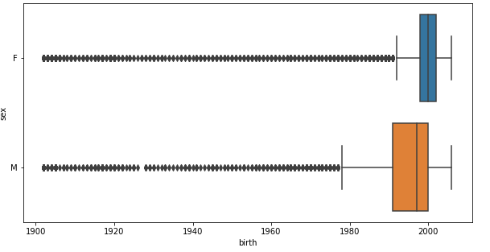

# Project_film_photography
## Территория развития пленочной фотографии
_Выполнили: Мельникова Татьяна, Боброва Анна, Митина Алёна, Левина Юлиана_

Наш проект посвящен изучению развития пленочной фотографии на основе анализа групп ВКонтакте, посвященных этой теме.
Для исследования мы выбрали следующие группы: [無秩序と工芸](https://vk.com/besporyadokitehnologia), [Плёнка](https://vk.com/trita.plenka), [Зелёная зона](https://vk.com/zonazeleni) и [ПленКа](https://vk.com/plenka_predlozhka). 

Мы поставили перед собой следующие задачи:
1. Выявить центры наибольшей популярности пленочной фотографии на основе участников 4-х групп: [無秩序と工芸](https://vk.com/besporyadokitehnologia), [Плёнка](https://vk.com/trita.plenka), [Зелёная зона](https://vk.com/zonazeleni), [ПленКа](https://vk.com/plenka_predlozhka).
2. Определить социальные и статистические характеристики участников пабликов. 
3. Определить, на какие пленки и фотоаппараты снимают чаще, чем на другие.
4. Определить, в какие периоды был пик популярности пленочной фотографии.
5. Сравнить исследуемые группы. Определить существующие сетевые взаимодействия между представителями конкретных территорий.
6. Структурировать и визуализировать полученные данные.

**Описание проекта:**

Исследование позволило нам изучить сферу развития плёночной фотографии в рамках сообществ ВКонтакте. Мы хотели бы поделиться полученными результатами. 

В ходе работы над проектом мы пришли к выводу, что центрами наибольшей популярности плёночной фотографии являются Москва и Санкт-Петербург. 
 

**График распределения по городам в паблике "無秩序と工芸"**

График показывает, что в группе "無秩序と工芸" наибольшее количество участиников из Москвы и Санкт-Петербурга, а также из Минска. 

**График распределения по городам в паблике "ПленКа"**

**График распределения по городам в паблике "зелёная зона"**

Кроме того, мы провели анализ аудитории этих четырёх пабликов, что позволило нам выявить социальные и статистические характеристики участников. Так, следующие графики ярко демонстрируют большую популярность пабликов [названия] среди женского населения. При этом примечательно, что в [Танином паблике] почти одинаковое количество мужчин и женщин среди подписчиков, что говорит о многообразии и разноплановости контента этого паблика. 
Анализ участников также позволил нам средний возраст большинства участников. [прокомментировать, какой там возраст]

[вставить график с сопоставлением мужчин и женщин и их возрастами] 

**График сопоставления мужчин и женщин в паблике "無秩序と工芸"**

График показывает, что количество участиников женского пола превышает количество участиников мужского пола, однако эта разница небольшая, относительно остальных групп в данном исследовании.

**График сопоставления мужчин и женщин в паблике "ПленКа"**

**График сопоставления мужчин и женщин в паблике "зелёная зона"**

**График распределения по возрасту участиников паблика "無秩序と工芸"**

На графике видно, что популярность пленочной фотографии прямопропорционально возрастает среди участиников 1988 года рождеия до 2000 года рождения. Наибольщее количество увлеченных пленочной фотографией приходится на участиников 2000 года рождения. Начиная с участиников 2001 года рождения количество увлеченных пленоной фотографии начинает снижаться. 

**График распределения по возрасту участиников паблика "ПленКа"**

**График распределения по возрасту участиников паблика "зелёная зона"**

**График распределения мужчин и женщин по возрасту паблика "無秩序と工芸"**

**График распределения мужчин и женщин по возрасту паблика "ПленКа"**

**График распределения мужчин и женщин по возрасту паблика "зелёная зона"**

Анализ постов позволил нам выявить, на какие пленки и фотоаппараты снимают чаще, а также в какие периоды популярность плёночной фотографии достигала своего пика:

**Таблица с типами пленок**

Тип пленки                |無秩序と工芸 | Плёнка | Зелёная зона | ПленКа | 
--------------------------|-------    |------  |--------------|------- |
kodak                     |           | 3264   | 1155         | 23
fuji                      |           |   1539 | 438          | 2
mju                       |           |    0   | 408          | 3
ilford                    |           | 1225   | 138          | 8
portra                    |           |  965   | 114          | 9

**Таблица с названиями фотоаппаратов**

Название фотоаппарата     |無秩序と工芸 | Плёнка | Зелёная зона | ПленКа | 
--------------------------|-------    |------  |--------------|------- |
olympus                   |           |   818  | 757          | 8
canon                     |           |  1779  | 548          | 9
zenit / зенит             |           |   949  | 410          | 5
nikon                     |           |  1128  | 219          | 7
pentax                    |           |    707 | 139          | 3
samsung                   |           |    0    | 89          | 0
minolta                   |           |  507   | 154          | 0
mamiya                    |           | 500    |              | 0       |

**Таблица с годами высокой популярности плёночной фотографии**

Года высокой популярности |無秩序と工芸 | Плёнка | Зелёная зона | ПленКа | 
--------------------------|-------    |------  |--------------|------- |
2018                      |           |  2789  | 1700         | 0
2019                      |           | 2892   | 1223         | 0
2020                      |           |  2010  | 953          | 51
2013                     |            | 8997   |              | 0      |
2012                     |            | 6856  |              | 0       |
2017                     |            | 3262  |              | 0       |
2014                     |            | 2933  |              | 0       |
2016                     |            | 2520  |              | 0       |
2015                     |            | 2066  |              | 0       |
2011                     |            | 719  |              | 0       |

Нам также показалось интересным посмотреть на пересечения и возможные сетевые взаимодействия участников исследуемых нами четырёх групп. Мы пришли к выводу, что [проанализировать, к чему мы там пришли]. 

**График распределения по городам во всех пабликах**

**График сопоставления мужчин и женщин во всех пабликах**

 

**График распределения по возрасту во всех пабликах**

**График распределения мужчин и женщин по возрасту во всех пабликах**

Таким образом, наше исследование показывает развитие плёночной фотографии в странах СНГ. Разумеется, стоит принимать во внимание, что это исследование имеет некоторые ограничения, поскольку развитие плёночной фотографии выходит далеко за рамки групп ВКонтакте. И все же оно позволяет получить некое представление об аудитории этих групп и об основных тенденциях в развитии плёночной фотографии, таких как места распространения и периоды всплеска и угасания популярности.
